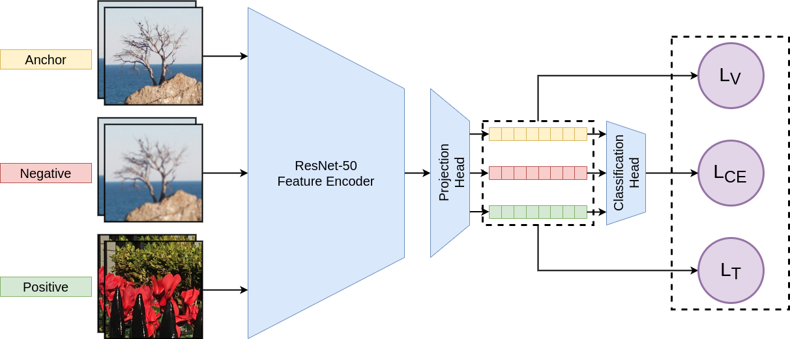

# SRDM — Super-Resolution Detection Method

SRDM is a new upscaled-resolution-detection method based on learning of visual representations using contrastive and
cross-entropy losses.

See our [paper](https://arxiv.org/pdf/2205.10406.pdf) for details.

## Dependencies and Installation

- Python >= 3.8 (Recommend to use [Anaconda](https://www.anaconda.com/download/#linux)
  or [Miniconda](https://docs.conda.io/en/latest/miniconda.html))
- [PyTorch >= 1.8](https://pytorch.org/)

### Installation

1. Clone repo
    ```bash
    git clone https://github.com/msu-video-group/SRDM.git
    cd SRDM
    ```

2. Install dependent packages
   ```bash
    pip install -r requirements.txt
    ```

## Quick Inference

1. Download pre-trained models
   from [Google Drive](https://drive.google.com/drive/folders/1kUYLX2PyM6gZomMHDlVG-C1CSuqT1Q7P?usp=sharing). Place the
   models in ```./pretrained_models```. We provide two models: MobileNet and ResNet.
2. Place your own videos as:

```bash
  $ tree data
  ├── data
      ├── video_001
      │   ├── frame_001.png
      │   ├── frame_002.png
      │   └── ...
      ├── video_002
      │   ├── frame_001.png
      │   ├── frame_002.png
      │   └── ...
      └── ...
  ```

3. We provide a criterion for fake-resolution video. The method returns the probability of fake resolution for each
   frame. Then if 0.1 quantile of probabilities is bigger than 0.5 the video will be considered as fake-resolution
   video. You can config your own criteron in the test.py
4. Run test.
   ```bash
   python3 test.py --pretrained=<checkpoint> --test-data-path=<data path> --n_frames=<> --embedding-size=<> --model=<>
   ```
5. For example.
   ```bash
   python3 test.py --pretrained=./pretrained_models/resnet-emb-64-n_fr-3.pt --test-data-path=<data path> --n_frames=3 \
           --embedding-size=64 --model=resnet
   ```

## Description

SRDM is initially described in [paper](https://arxiv.org/pdf/2205.10406.pdf). It's a novel approach to video-super-resolution detection that combines
contrasting and supervised learning. The method first uses a ResNet backbone to extract deep features and then uses a
lightweight MLP networks to project and classify representation of input frames. Our method achieved good performance in
extensive experiments.



## Main Results on MSU Video Super-Resolution Benchmark

|  SR method  |  Accuracy   |     |   SR method   | Accuracy |
|:-----------:|:-----------:|-----|:-------------:|:--------:|
| Real-ESRGAN |    0.875    |     |  Real-ESRnet  | 1.000 |
| DynaVSR-R |  1.000      |     |   DynaVSR-V   | 1.000 |
| D3Dnet | 1.000 |     |     DBVSR     | 1.000 |
| DUF-16L | 1.000 |     |    DUF-28L    | 1.000 |
| ESPCN | 0.875 |     |     LGFN      | 1.000 |
| RRN-10L | 1.000 |     |    RRN-5L     | 1.000 |
| SOF-VSR-BD | 1.000 |     |  SOF-VSR-BI   | 1.000 |
| TDAN | 1.000 |     |    RealSR     | 0.875 |
| ESRGAN | 0.625 |     |      TGA      | 1.000 |
| RSDN | 1.000 |     |     RBPN      | 1.000 |
| iSeeBetter | 1.000 |     |     TMNet     | 1.000 |
| GFPGAN | 1.000 |     |    SwinIR     | 0.875 |
| SRMD | 1.000 |     |     comisr    | 1.000 |
| waifu2x-cunet | 1.000 |     | waifu2x-anime | 1.000 |
| BasicSR | 1.000 |     |      VRT      | 1.000 |


## Training

### Data preparation

```bash
  $ tree data
  ├── train
  │   ├── original
  │   │   ├── GT
  │   │   │   ├── video_001
  │   │   │   │   ├── frame_001.png
  │   │   │   │   └── ...
  │   │   │   ├── video_002
  │   │   │   │   ├── frame_001.png
  │   │   │   │   └── ...
  │   │   │   └── ...
  │   │   ├── SR method 1
  │   │   │   ├── video_001
  │   │   │   │   ├── frame_001.png
  │   │   │   │   └── ...
  │   │   │   ├── video_002
  │   │   │   │   ├── frame_001.png
  │   │   │   │   └── ...
  │   │   │   └── ...
  │   │   └── ...
  │   └── compressed
  │   │   │   ├── video_001
  │   │   │   │   ├── frame_001.png
  │   │   │   │   └── ...
  │   │   │   ├── video_002
  │   │   │   │   ├── frame_001.png
  │   │   │   │   └── ...
  │   │   │   └── ...
  │   │   ├── SR method 1
  │   │   │   ├── video_001
  │   │   │   │   ├── frame_001.png
  │   │   │   │   └── ...
  │   │   │   ├── video_002
  │   │   │   │   ├── frame_001.png
  │   │   │   │   └── ...
  │   │   │   └── ...
  │   │   └── ...
  └── val
      └── ... 
  ```

### Training from scratch

To train a SRDM on your data from
scratch, [change path to your dataset](https://github.com/msu-video-group/SRDM/blob/main/config.py#:~:text=_C.DATA.DATA_PATH_TRAIN,SOF_VSR%27%2C%20%27Topaz%27%2C%20%27LGFN%27%5D)
and run:

```bash
python3 main_worker.py --num_workers=2 --n_frames=2 --model-name=resnet --batch-size=32 
```

## Cite Us
@article{meshchaninov2022combining,
  title={Combining Contrastive and Supervised Learning for Video Super-Resolution Detection},
  author={Meshchaninov, Viacheslav and Molodetskikh, Ivan and Vatolin, Dmitriy},
  journal={arXiv preprint arXiv:2205.10406},
  year={2022}
}


